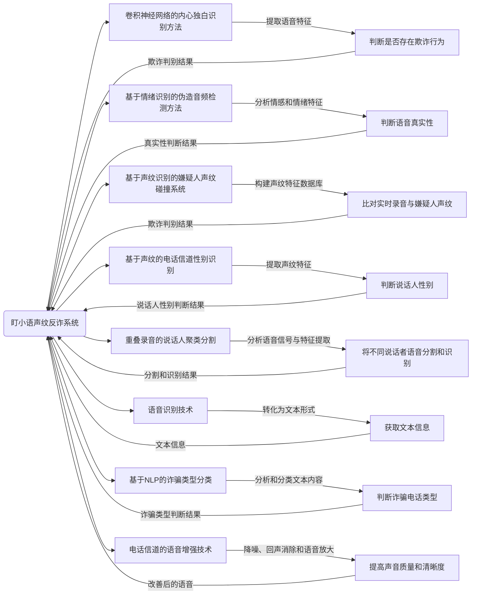

## 盯小语声纹反诈系统详细说明

### 简介
盯小语声纹反诈系统是一种基于多项核心技术的声纹识别系统，旨在通过使用语音特征和深度学习算法，识别和防范各类声纹反欺诈活动。该系统通过准确分析和识别语音中的声纹特征、情绪特征、嫌疑人声纹，以及预测诈骗类型等方式，实现了高效的电话信道欺诈检测和防范。系统主体处理流程及框架如下图1所示。

该流程图展示了盯小语声纹反诈系统各个模块之间的关系及其功能、输入和输出。每个模块都被标明，并且根据模块的功能，给出了相应的输入和输出。这些模块包括：

    卷积神经网络的内心独白识别方法：提取内心独白中的语音特征，并判断是否存在欺诈行为。输入为内心独白语音，输出为欺诈判别结果。
    基于情绪识别的伪造音频检测方法：分析语音中的情感和情绪特征，并判断语音真实性。输入为语音数据，输出为真实性判断结果。
    基于声纹识别的嫌疑人声纹碰撞系统：通过建立声纹特征数据库，比对实时录音与嫌疑人声纹，判断是否存在欺诈行为。输入为实时录音和嫌疑人声纹数据，输出为欺诈判别结果。
    基于声纹的电话信道性别识别：提取声纹特征，判断说话人性别。输入为语音数据，输出为说话人性别判断结果。
    重叠录音的说话人聚类分割：分析语音信号与特征，将不同说话者的语音分割和识别。输入为重叠录音数据，输出为分割和识别结果。
    语音识别技术：将语音转化为文本形式，获取文本信息。输入为语音数据，输出为文本信息。
    基于NLP的诈骗类型分类：分析和分类诈骗电话的文本内容，判断诈骗类型。输入为文本信息，输出为诈骗类型判断结果。
    电话信道的语音增强技术：降噪、回声消除和语音放大，提高声音质量和清晰度。输入为语音数据，输出为改善后的语音。
### 核心技术和方法

#### 1. 基于卷积神经网络的内心独白识别方法
基于卷积神经网络的内心独白识别方法采用了CNN模型，能够有效地提取内心独白中的语音特征，例如音调、节奏和语速等，并准确地判断是否存在欺诈行为。相对于传统方法而言，该方法具备以下优点：
1. 自动学习高级特征表示：卷积神经网络通过多层卷积和池化操作，能够自动学习数据中的抽象特征表示，避免了手动设计特征的繁琐过程。相比传统方法，这种自动学习能力使得内心独白识别更具准确性和鲁棒性。
2. 网络结构适应性强：CNN网络结构可以根据任务要求和数据特点进行灵活设计和调整。通过合理选择卷积核大小、层数、滤波器个数等参数，CNN模型能够更好地适应语音信号的特征提取需求，从而提高内心独白识别的性能。
3. 大规模训练数据利用：CNN模型对于大规模训练数据的需求较少，即便在有限的训练样本情况下也具备较好的表现。这一优点在声纹反诈系统中尤为重要，因为通常情况下安全训练数据较难获取。
具体而言，基于卷积神经网络的内心独白识别方法可以通过以下步骤进行：
1. 数据预处理：对输入语音信号进行预处理，如采样率转换、降噪和语音分割等，以提高数据质量和有效性。
2. 特征提取：利用卷积操作和池化操作从预处理后的语音信号中提取语音特征。典型的特征包括频谱图、梅尔频谱图和倒谱系数等。
3. 网络设计与训练：设计合适的卷积神经网络结构，包括卷积层、池化层和全连接层，然后使用大规模的带有标签的正常和欺诈语音数据集进行训练。训练过程中，通过优化算法，如随机梯度下降（SGD）或自适应矩估计（Adam），逐步调整网络权重，使其逐渐逼近最佳状态。
4. 模型评估和部署：使用另外的标注数据集对训练好的模型进行评估，包括准确率、召回率、F1值等指标。在达到预先设定的性能要求后，将模型部署到实际声纹反诈系统中。
综上所述，基于卷积神经网络的内心独白识别方法充分利用了CNN的自动学习特征表示和网络结构灵活性的优势，能够有效提高声纹反诈系统的准确性和鲁棒性。

#### 2. 基于情绪识别的伪造音频检测方法
基于情绪识别的伪造音频检测方法利用深度学习模型分析语音中的情感和情绪特征，以判断语音是否为真实。这种方法相比传统的伪造音频检测方法具有更高的准确性和鉴别能力。具体而言，该方法包括以下核心技术和方法：
1. 情感和情绪特征提取：通过音调、语速、情感强度等方面的特征分析，将语音转化为情感和情绪表达形式。这些特征可以通过声学分析方法，如基频提取、语音分割和特征提取算法等来获取。
2. 深度学习模型：采用深度学习模型对提取到的情感和情绪特征进行建模和分类。常用的深度学习模型包括卷积神经网络（CNN）、长短时记忆网络（LSTM）和注意力机制模型等。这些模型能够自动学习特征表示和分类决策规则，从而提高伪造音频的识别准确度。
3. 数据集构建：为训练和评估深度学习模型，需要构建大规模的包含真实和伪造音频的标注数据集。该数据集应涵盖各种真实和伪造音频的情感和情绪表达。数据集的准确性和多样性对于模型的训练和性能评估具有重要意义。
相较于传统的伪造音频检测方法，基于情绪识别的方法具有以下优点：
1. 更准确的鉴别能力：传统方法主要依赖于声学特征的判断，而基于情绪识别的方法则结合了语音中的情感和情绪信息。这些信息通常对于判断语音是否为真实具有更高的鉴别能力，能够更有效地区分真实和伪造音频。
2. 自动学习能力：深度学习模型在基于情绪识别的方法中能够自动学习语音中的情感和情绪特征表示。相比传统方法需要手动设计特征的方式，深度学习模型能够从大量数据中学习到更抽象和高级的特征表示，提高了伪造音频检测的性能。
总结而言，基于情绪识别的伪造音频检测方法通过分析语音中的情感和情绪特征，并应用深度学习模型进行鉴别分类，提高了伪造音频的检测准确性和鉴别能力。这种方法在声纹识别和语音破解等领域具有广泛的应用前景。

#### 3. 基于声纹识别的嫌疑人声纹碰撞系统
基于声纹识别的嫌疑人声纹碰撞系统是一种利用声纹识别技术对嫌疑人进行辨识和比对的系统。该系统通过建立一个声纹特征数据库，并运用声纹识别算法将实时录音与数据库中的嫌疑人声纹进行比对，以判断是否存在欺诈行为。相较于传统的声纹识别系统，该系统具有更高的准确性和实时性。
该系统采用了以下核心技术和方法：
1. 声纹特征提取：通过使用声纹特征提取算法，从语音信号中提取出具有唯一性的声纹特征。常用的声纹特征提取方法包括梅尔频率倒谱系数（MFCC）、线性预测编码（LPC）等。这些方法能够将语音信号转化为具有区分性的声纹特征，为后续的声纹识别提供数据基础。
2. 声纹特征建模：通过使用声纹特征建模方法，将声纹特征映射到一个可识别的空间。常用的声纹特征建模方法包括高斯混合模型（GMM）、支持向量机（SVM）和深度神经网络（DNN）等。这些方法能够对声纹特征进行建模和学习，提高声纹识别的准确性和鲁棒性。
3. 声纹匹配和碰撞：通过使用声纹匹配算法，将实时录音与数据库中的嫌疑人声纹进行比对和匹配。常用的声纹匹配算法包括高斯混合模型-通用背景模型（GMM-UBM）、i-vector和深度神经网络（DNN）等。这些算法能够计算出两个声纹之间的相似度或距离，从而判断是否存在欺诈行为。

与传统的声纹识别系统相比，基于声纹识别的嫌疑人声纹碰撞系统具有以下优点：
1. 更高的准确性：该系统采用了先进的声纹识别算法和特征建模方法，能够提取更具区分性的声纹特征，并实现更精准的声纹匹配和碰撞。因此，能够提供更高的嫌疑人辨识准确性。
2. 更高的实时性：该系统能够对实时录音进行快速的声纹比对和匹配，实现实时的嫌疑人声纹辨识。相较于传统的声纹识别系统，能够在更短的时间内做出判断，提高了应用的实时性。
基于声纹识别的嫌疑人声纹碰撞系统是一种优秀的声纹应用技术，具有广泛的应用前景，在犯罪调查、欺诈检测等领域有重要意义。

#### 4. 基于声纹的电话信道性别识别
基于声纹的电话信道性别识别是一种利用声纹识别技术对电话通话中的说话者性别进行自动判别的方法。该方法通过从语音中提取声纹特征，如频谱和共振峰等，结合机器学习算法，能够准确地识别出说话者的性别。相较于传统的电话信道性别识别方法，基于声纹的方法有以下优点：

1. 无需收集性别信息：传统的电话信道性别识别方法需要事先收集说话者的性别信息，而基于声纹的方法不需要这一步骤，可以直接从电话通话中提取声纹特征进行识别，简化了系统部署流程。

核心技术和方法：
1. 声纹特征提取：通过使用声纹特征提取算法，从电话通话中提取声音的频谱特征和共振峰等信息。常用的声纹特征提取方法包括梅尔频率倒谱系数（MFCC）、线性预测编码（LPC）和倒谱分析等。这些方法能够将语音信号转化为具有区分性的声纹特征。
2. 机器学习算法：将声纹特征输入到机器学习算法中进行建模和训练。常用的机器学习算法包括高斯混合模型（GMM）、支持向量机（SVM）和深度神经网络（DNN）等。这些算法能够通过学习和训练，建立声纹特征与性别之间的映射关系。
基于声纹的电话信道性别识别方法具有较高的准确性和实用性。它不仅可以应用于电话客服中自动判断客户性别，还可以在一些特定场景下用于追踪嫌疑人或调查犯罪案件等领域。通过结合声纹识别技术和机器学习算法，该方法能够实现快速、准确的性别识别，为语音相关应用提供了更多可能性。总之，基于声纹的电话信道性别识别是一种值得广泛应用的技术，对于提高通信服务质量和优化用户体验具有重要意义。

#### 5. 重叠录音的说话人聚类分割
重叠录音的说话人聚类分割是一种利用声纹识别技术对重叠录音中的不同说话者进行有效分割和识别的方法。该方法通过对语音信号进行分析和特征提取，并利用聚类算法将不同说话者的语音进行区分和提取。相较于传统的重叠录音处理方法，基于声纹的说话人聚类分割具有以下优点：

1. 非依赖于麦克风阵列：传统的重叠录音处理方法通常需要使用麦克风阵列等硬件设备来实现说话人分离，而基于声纹的方法可以直接从录音中提取声纹特征，无需额外设备。

核心技术和方法：
1. 声纹特征提取：通过声纹特征提取算法从重叠录音中提取每个说话者的声纹特征。常用的声纹特征提取方法包括梅尔频率倒谱系数（MFCC）、线性预测编码（LPC）和倒谱分析等。这些方法能够将语音信号转化为具有区分性的声纹特征。
2. 聚类算法：将提取到的声纹特征输入到聚类算法中进行分析和聚类。常用的聚类算法包括K均值聚类、层次聚类和谱聚类等。这些算法能够将具有相似声纹特征的语音样本归为同一类别，实现说话人的分割和识别。
基于声纹的说话人聚类分割能够准确地将重叠录音中的不同说话者进行区分和提取，为多人对话的语音信号处理提供了有效的解决方案。该方法可以应用于语音转写、电话会议录音处理等场景，提高了语音处理的准确性和效率。总之，基于声纹的说话人聚类分割是一种具有广泛应用前景的技术，对于实现重叠录音的自动分割和识别具有重要意义。

#### 6. 语音识别技术
语音识别技术通过将语音转化为文本形式，为后续的信息分析和处理提供了便利。该技术利用深度学习模型，如循环神经网络（RNN）或转录模型CTC (Connectionist Temporal Classification)，能够实现准确和快速的语音转文本转换。

核心技术和方法：
1. 循环神经网络（RNN）：RNN 是一种递归神经网络，它能够对序列数据进行建模。在语音识别中，RNN 可以通过将连续的语音帧作为输入，逐帧地预测下一个语音帧对应的文本标签。通过反向传播算法和梯度下降优化，RNN 模型能够自动学习语音到文本的映射关系。
2. 转录模型CTC (Connectionist Temporal Classification)：CTC 是一种无须对齐信息的序列转录算法，特别适用于语音识别任务。CTC 模型通过引入额外的“空白标记”来解码输入的语音序列，将多个连续相同标记合并为一个，并且通过最大似然准则来训练模型。CTC 可以处理变长的输入序列和输出序列，使得语音识别更加灵活和准确。

相较于传统的语音识别技术，基于深度学习的语音识别具有以下优点：
1. 更好的泛化能力：深度学习模型能够自动提取语音特征，并学习到更通用的表示，从而提升了在不同说话人、环境和语速下的识别准确率。
2. 减少人工特征工程：传统的语音识别技术需要手动设计特征提取算法，而深度学习模型可以端到端地学习从语音到文本的映射关系，减少了对人工特征工程的依赖。
3. 快速训练和推理：深度学习模型可以通过并行计算和GPU加速来加快训练和推理的速度，使得语音识别可以在实时或近实时的应用中得以实现。

总之，基于深度学习的语音识别技术在准确性、泛化能力和效率方面都有显著的提升，并在语音转文本的任务中发挥着重要的作用。

#### 7. 基于NLP的诈骗类型分类
诈骗电话是一种常见的形式的欺诈活动，针对此类电话进行自动化的类型分类可以帮助识别和应对不同类型的诈骗行为。基于自然语言处理（NLP）的诈骗类型分类技术结合文本分析和情感分析，能够自动判断诈骗电话的类型，如财务诈骗、冒充诈骗等。

1. 文本特征提取：基于NLP的诈骗类型分类首先需要从电话内容中提取有用的文本特征。常用的特征提取方法包括词袋模型（Bag-of-Words）、TF-IDF（Term Frequency-Inverse Document Frequency）等。这些方法可以将文本转化为数值表示，以便后续模型处理和分析。
2. 机器学习模型：基于提取的文本特征，可以使用机器学习模型进行分类。常用的模型包括朴素贝叶斯分类器、支持向量机（SVM）、逻辑回归等。这些模型可以通过训练集的学习，自动学习到不同诈骗类型之间的区分特征，从而实现对新数据的类型分类。
3. 情感分析：除了通过文本特征进行分类外，还可以结合情感分析来增强分类准确性。情感分析可以判断文本中传递的情感倾向，如积极、消极或中性。通过对诈骗电话中的文本进行情感分析，可以进一步区分出不同类型的诈骗行为。

相比传统的人工分类方法，基于NLP的诈骗类型分类具有以下优点：
1. 自动化和高效性：使用NLP技术可以实现对大量诈骗电话的自动分类，提高了处理速度和效率。
2. 多样性的特征表示：基于文本特征的提取方法可以从多个角度捕捉诈骗电话的关键特征，而传统的人工分类方法往往依赖于有限的识别规则。
3. 结合情感分析：情感分析能够更好地理解文本内容中的情感信息，从而辅助类型分类任务，增强分类结果的准确性。

综上所述，基于NLP的诈骗类型分类技术结合了文本特征提取和情感分析，能够自动化地对诈骗电话进行分类，具有自动化和高效性、多样性的特征表示以及结合情感分析的优点。这种技术可以在识别和应对诈骗行为方面发挥重要作用。

#### 8. 电话信道的语音增强技术
电话信道的语音增强技术是一种通过算法和方法来提高电话通话中声音质量和清晰度的技术。这些技术包括降噪、回声消除和语音放大等方法，旨在去除噪音和干扰，使识别系统能够更准确地分析语音特征和声纹信息。
1. 降噪技术：降噪技术主要用于去除电话信道中的噪音干扰。常用的降噪方法包括基于统计模型的降噪算法（如Wiener滤波器）、子带域降噪算法（如MMSE-LSA算法）和深度学习算法（如卷积神经网络降噪）。这些方法利用噪音和语音信号之间的统计特性，通过滤波和估计方法来减少或消除噪音的影响。与传统降噪方法相比，深度学习算法可以自动学习噪音和语音信号之间的映射关系，具有更好的降噪效果。
2. 回声消除技术：回声是由于语音音频在电话通话过程中由扬声器输出而被麦克风重新捕获而产生的。回声消除技术旨在通过模型和滤波器来减少或消除回声的影响。常用的回声消除方法包括自适应滤波器（如LMS算法）、双向递归滤波器（如NLMS算法）和频域回声抑制算法（如LCR算法）。这些方法利用麦克风输入信号和扬声器输出信号之间的差异来估计和抵消回声信号，以提高语音信号的清晰度和质量。
3. 语音放大技术：语音放大技术旨在提高电话通话中的语音信号强度，使得语音更加清晰可听。常用的语音放大方法包括自动增益控制（AGC）和自适应增益控制（AGC）等。这些方法通过调整语音信号的增益或放大系数，使得语音信号的强度在合适的范围内，不会太弱或太强，从而保证语音信号的可听度。
综上所述，电话信道的语音增强技术通过降噪、回声消除和语音放大等方法，改善电话通话中的声音质量和清晰度。这些技术使用了各种专业的算法和模型，如Wiener滤波器、MMSE-LSA算法、卷积神经网络降噪、自适应滤波器和频域回声抑制算法等。与传统技术相比，这些方法具有更好的降噪效果、更高的回声消除性能和更可听的语音放大效果。通过应用这些技术，电话通话中的语音质量得到了显著改善。

### 总结
盯小语声纹反诈系统通过采用多项核心技术和方法，实现了高效的电话信道欺诈检测和防范。基于卷积神经网络的内心独白识别、基于情绪识别的伪造音频检测、基于声纹识别的嫌疑人声纹碰撞等，为系统提供了准确性和稳定性的增强。同时，语音识别技术、基于NLP的诈骗类型分类和电话信道的语音增强技术等，进一步提升了系统的功能和可用性。此系统对于保护用户的信息安全和防范电话信道欺诈具有重要的应用价值。

